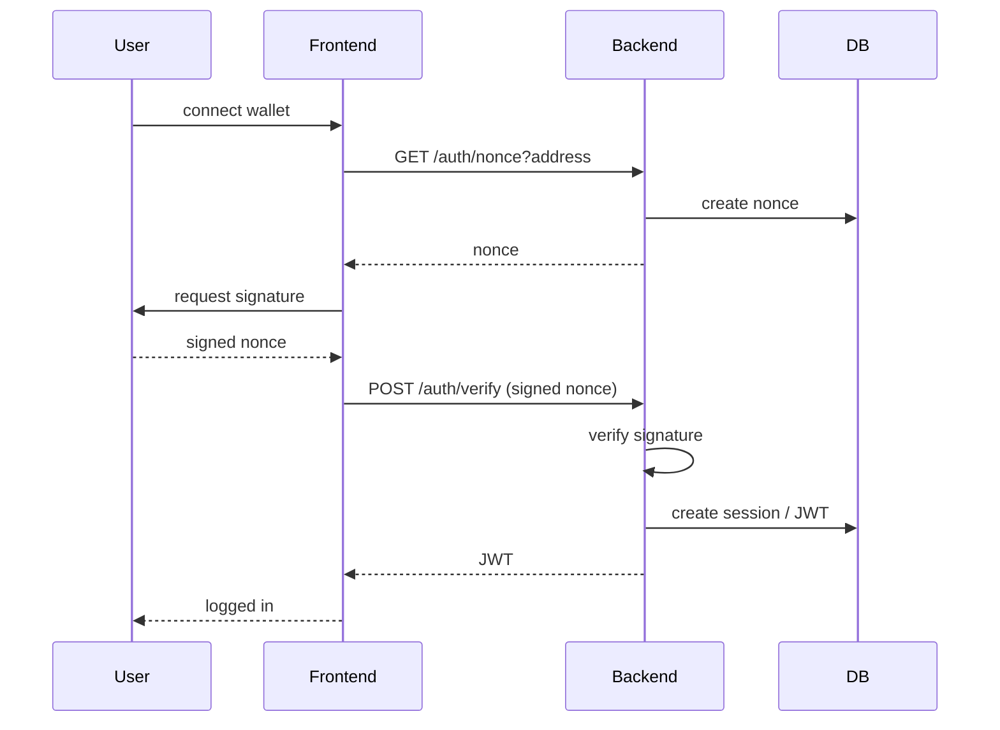
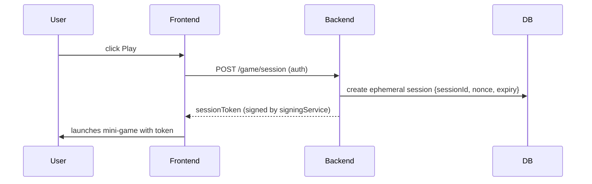
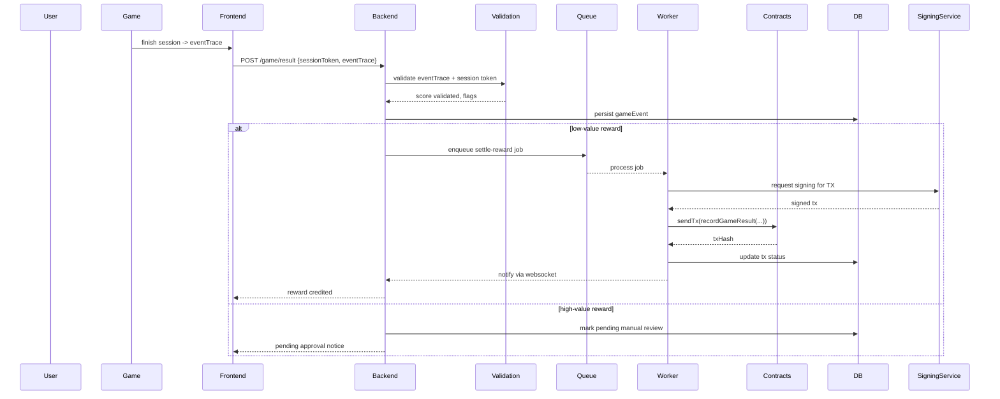
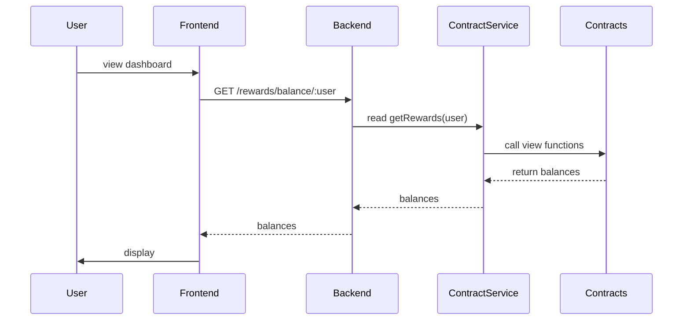
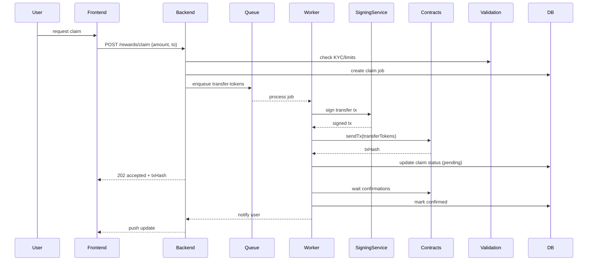
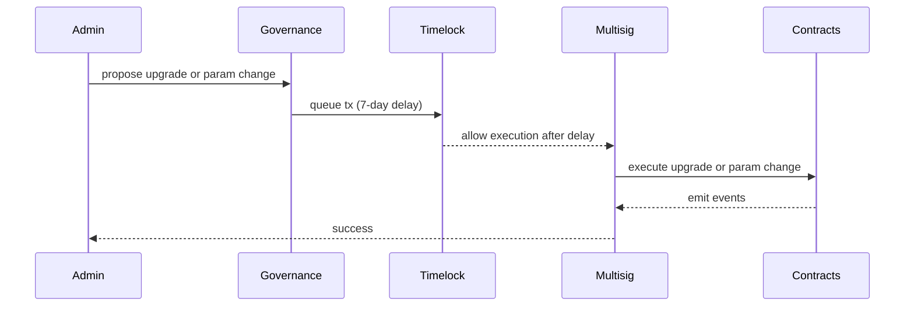

<!--
AGIS System Architecture
Version: 1.0
Date: 2026-01-05
-->

# AGIS System Architecture

Version: 1.0
Date: 2026-01-05

## 1. Overview

AGIS is a hybrid on‑chain / off‑chain game economy built around a browser mini‑game. Players earn XP and token rewards through gameplay; rewards are recorded and settled on chain through upgradeable smart contracts. The system is designed for safety-first operation, clear auditability, and robust fraud and compliance controls.

Key components:
- Frontend: Next.js app + embedded browser mini‑game (iframe), wallet integrations.
- Backend: Express TypeScript API and background workers, `ContractService` bridging to the blockchain.
- Contracts: `AGISX` token, `RewardsPool`, `FeeRouter`, `GameEngine` (upgradeable proxies).
- Infra: RPC pools, KMS/HSM for signing, Postgres DB, Redis queues, observability stack.
- Governance: timelock + multisig for upgrades/parameter changes; compliance hooks for KYC/AML.

Primary goals:
- Protect user funds and prevent exploit/drain.
- Transparent, auditable reward flows.
- Minimize attack surface through least privilege and KMS-backed signing.
- Server-authoritative integrity for high-value rewards.

---

## 2. Architecture Components

### Frontend

- Next.js application serves the UI and embeds the mini‑game under `/public/agis-game`.
- Wallet integrations: MetaMask (injected provider), WalletConnect v2. Wallet sign-in is based on a nonce/signature flow.
- UI surfaces: dashboard, wallet connect modal, XP & rewards display, game launcher, claim flow.
- Communication with backend: HTTPS REST endpoints (JWT or session + wallet-signed actions) and WebSocket/Server-Sent-Events for tx updates.

How it talks to backend:
- Auth: `GET /auth/nonce?address` → user signs → `POST /auth/verify` → backend issues short-lived JWT.
- Game: `POST /game/session` (request signed session token) → game uses token and returns `POST /game/result` with signed event-trace.
- Rewards: `GET /rewards/balance/:user` and `POST /rewards/claim`.

### Backend

Backend responsibilities:
- Validate and persist game sessions and results.
- Authorize withdrawals and enqueue on‑chain transactions.
- Read on‑chain state and present it to users.
- Provide signing service interface to KMS-backed signers (via `signingService`).

Key services:
- `authService` — wallet nonce/verify, session issuance, account binding.
- `contractService` — read/write wrappers for contracts (ethers v6 patterns). Read calls are immediate; writes are queued.
- `signingService` — KMS/HSM integration for transaction signing.
- `txWorker` — queued worker that signs & submits transactions, handles retries and gas bumping.
- `validationService` — scoring and event-trace validation (anti-cheat).
- `auditService` — append-only audit logs, writes to immutable storage and cross-checks on-chain events.
- `rateLimiter` — Redis-backed per-IP, per-wallet and per-route limits.

Storage & persistence:
- Primary DB: Postgres for users, sessions, game events, reward ledger, audit records.
- Redis: queues (Bull), rate limiting, short-term caching.

### Contracts

- `AGISX` (ERC20 upgradeable): on‑chain token for rewards and marketplace.
- `FeeRouter`: collects and splits protocol fees (reward pool, treasury, buyback, operator payout).
- `RewardsPool`: accrual accounting, vesting buckets, claimable balances.
- `GameEngine`: minimal on‑chain record for server-authorized results and audit logs.
- Upgradeability: UUPS or Transparent proxies controlled via `UPGRADER` role and a timelock + multisig.

Critical on‑chain properties:
- `Pausable` behaviors for emergency stop.
- Role-based access control (OpenZeppelin `AccessControl`).
- Reentrancy guards and gas-aware batching.

### Infrastructure

- RPC providers: pool of providers (Alchemy, Infura, public) with health checks and automatic failover.
- KMS/HSM: AWS KMS / Azure Key Vault / Cloud HSM for signing service.
- DB: Postgres with daily backups and WAL archiving.
- Queue: Redis (Bull) for job processing (settle rewards, handle tx submission retries).
- Observability: Prometheus metrics, Grafana dashboards, Sentry for errors, OpenTelemetry traces.
- CI/CD: GitHub Actions with static analysis (Slither), unit tests, hardhat compile & tests in CI.

---

## 3. End-to-End Flows (sequence diagrams)

All diagrams use Mermaid. Each flow shows the happy path and notes key failure branches.

### 3.1 Login / Sign-in with wallet



### 3.2 Start game session



### 3.3 Submit result (server-authoritative happy path)



### 3.4 Read XP / rewards balance



### 3.5 Claim rewards (queued tx & confirmations)



### 3.6 Admin pause / upgrade flow



---

## 4. Security & Risk Model

Top risks, how they could happen, mitigations, residual risk and monitoring.

### 4.1 Client-side cheat / large drains
- How: Malicious client submits fabricated high scores or replays.
- Mitigations:
  - Server-issued ephemeral session tokens and nonces; require event-trace signed by server or submit raw event traces for server-side replay verification.
  - Thresholds: small rewards auto-settled; high-value rewards flagged for manual review.
  - Rate limiting, replay detection (nonce use), device fingerprinting, and ML anomaly scoring.
- Residual risk: some low-value fraud may occur; monitor win-rate anomalies and set conservative auto-settle thresholds.

### 4.2 Private key compromise
- How: leaked env vars, compromised CI secrets, or developer mistakes.
- Mitigations:
  - KMS/HSM for all signing; enforce least privilege and role separation.
  - Hot/cold wallet split: hot wallet with daily limits; treasury multisig for large moves.
  - Secrets rotation and audit logs.
- Residual risk: if KMS account compromised, immediate freeze via timelock and emergency pause; alerting and forensics runbook.

### 4.3 Rogue upgrade/owner action
- How: owner private key or admin multisig is compromised or coerced.
- Mitigations:
  - Timelock controller for upgrades and param changes; multisig for execution.
  - Public proposal and monitoring windows; multi‑party governance for critical changes.
- Residual risk: collusion possible but slowed by timelock and public notice.

### 4.4 Economic inflation from unchecked minting
- How: `mint()` misused to create tokens without governance controls.
- Mitigations:
  - Hard caps, emission schedules embedded in contracts, or minting gated by timelock + multisig.
  - Transparent emission reports and on‑chain audits.
- Residual risk: policy errors in design; require audits and public dashboard.

### 4.5 Regulatory/gambling risk
- How: jurisdiction deems mechanics as gambling or requires KYC.
- Mitigations:
  - Geo-blocking for restricted jurisdictions; KYC gating for withdraws above thresholds.
  - Legal review, conservative payout limits until classification confirmed.
- Residual risk: changing law; maintain legal counsel and fast response plans.

### 4.6 Oracle manipulation
- How: price feeds used for USD thresholds are manipulated.
- Mitigations:
  - Multi-oracle strategy (Chainlink + backups), sanity checks and divergence alerts.
- Residual risk: correlated oracle outage; automatic degrade-to-conservative-mode.

Monitoring & Alerts (common across all risks): critical alerting on win-rate anomalies, large single-address drains, KMS errors, timelock proposals, increased failed tx ratio, and sustained RPC failures.

---

## 5. Compliance & User Safety

- KYC gating thresholds: e.g., any withdraw > $200/day triggers KYC flow; maintain configurable thresholds by jurisdiction.
- Geo-blocking: maintain a policy table and enforce in `authService` and `claim` flows.
- Session limits & cooldowns: per-account and per-device daily caps; cooldown between sessions configurable by tier.
- Self-exclusion and parental controls: allow users to opt into cooling-off windows and parental consent flows for minors.
- Transparent rewards UX: show clear claimable vs vested balances, pending statuses, and expected on‑chain gas costs.

Data privacy:
- PII stored encrypted at rest; access audited; retention policy with delete/archival options.

---

## 6. Implementation Roadmap (prioritized)

Each Phase includes acceptance criteria and minimal tests.

### Phase 1 — Core Safety (0–4 weeks)
- Goals:
  - Protect keys and avoid immediate drains.
  - Queue all write transactions through a robust worker.

Tasks:
  1. Integrate KMS-based `signingService` (AWS KMS / Key Vault) and update `contractService` to use it.
  2. Implement Redis queue + `txWorker` for write transactions (idempotent jobs, retries, gas bumping).
  3. Add rate limiting and optimistic request validation in backend.
  4. Implement short-lived session tokens for game sessions.

Acceptance criteria:
  - No private key stored in env; signing via KMS works in staging.
  - Demo claim flows use queue and worker; DB records reflect tx status.

### Phase 2 — Integrity & Economy Hardening (4–10 weeks)
- Goals:
  - Prevent and detect cheating; harden economic contracts.

Tasks:
  1. Upgrade game flow to server-authoritative for high-value rewards (session proofs, event traces).
  2. Build validation service with rule engine + ML pipelines for anomaly detection; manual review queue.
  3. Implement emission schedule and caps in `AGISX`/`RewardsPool` and lock core parameters behind Timelock.
  4. Add on‑chain event reconciliation worker and reporting.

Acceptance criteria:
  - No high-value reward is auto-settled without server validation or manual approval.
  - Emissions and cap unit tests pass and audited.

### Phase 3 — Governance & Compliance (10–16 weeks)
- Goals:
  - Make upgrades and parameter changes safe and auditable; integrate KYC/AML.

Tasks:
  1. Deploy TimelockController and require multisig for upgrades; wire UI for governance proposals.
  2. Integrate KYC/AML providers; implement compliance gating in claim flows.
  3. Legal review and policy docs for different jurisdictions.

Acceptance criteria:
  - All critical setters require timelock; governance workflows tested on staging.
  - KYC flow triggers at configured thresholds and stores proofs encrypted.

### Phase 4 — Observability & Polish (16–24 weeks)
- Goals:
  - Complete dashboards, alerts, runbooks, and developer experience.

Tasks:
  1. Instrument Prometheus metrics and OpenTelemetry traces across backend and workers.
  2. Create Grafana dashboards for economic KPIs and alert rules.
  3. Publish developer runbooks: local dev, deploy, incident response.

Acceptance criteria:
  - Alerting coverage for key incidents; runbooks validated by fire-drills.

---

## 7. Appendix — Minimal Developer Run Commands

Start frontend development:

```bash
cd frontend
npm install
npx next dev
```

Start backend development (local, no KMS):

```bash
cd backend
npm install
cp .env.example .env    # fill in DB and RPC placeholders
npm run dev
```

Compile contracts (networked environment):

```bash
cd contracts
npm ci
npx hardhat compile
```

---

## 8. Immediate Recommendations

1. Stop storing any private keys in environment variables; migrate signing into a KMS-backed `signingService` immediately.
2. Treat current mini‑game as a demo: add server-session tokens before enabling any on‑chain settlement.
3. Fix the `contracts` environment install issue (ETARGET) in CI by pinning compatible `@openzeppelin/hardhat-upgrades` version and running `npm ci` in a networked environment.

---

Document author: AGIS Architecture Bot (assistant)
